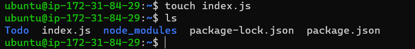
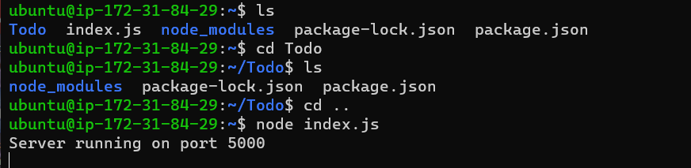
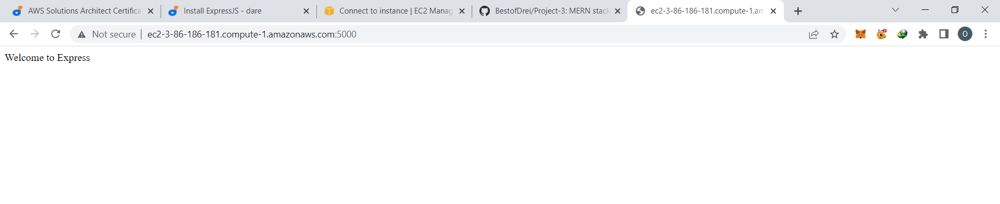
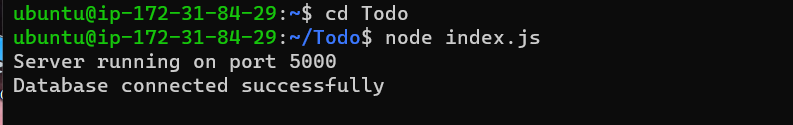
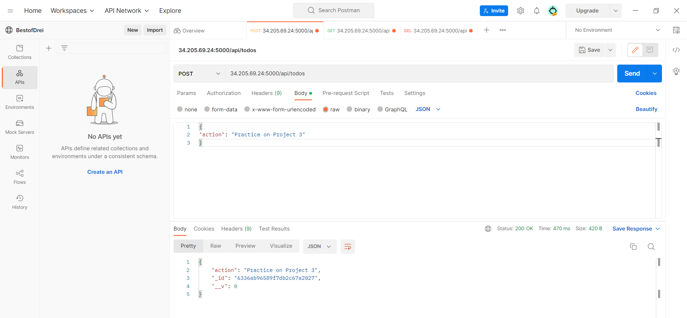
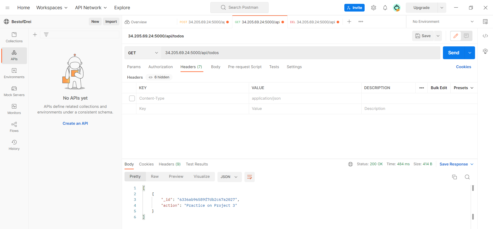
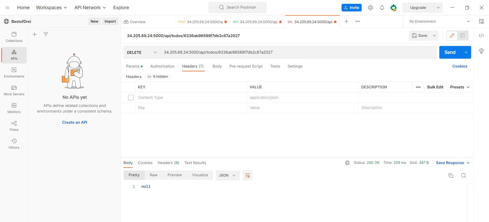
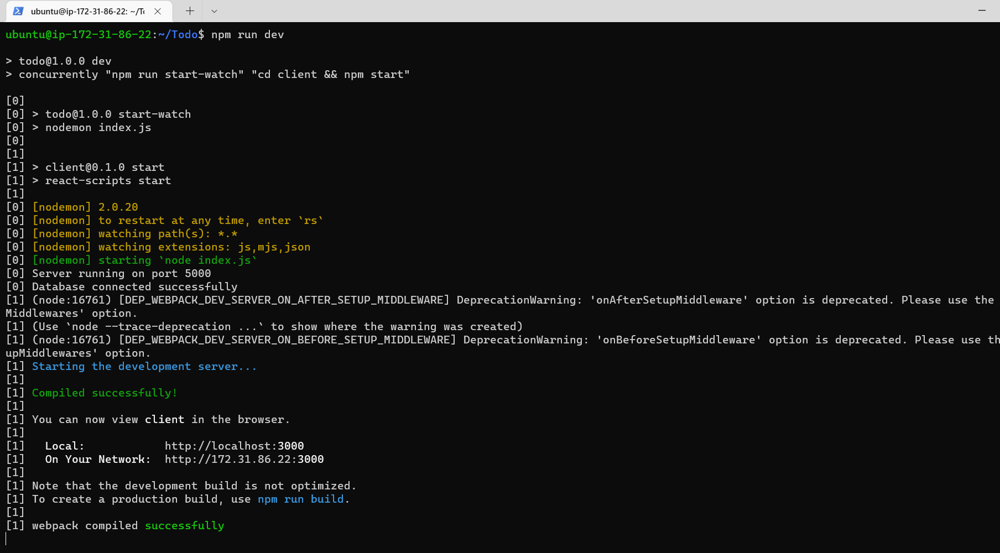
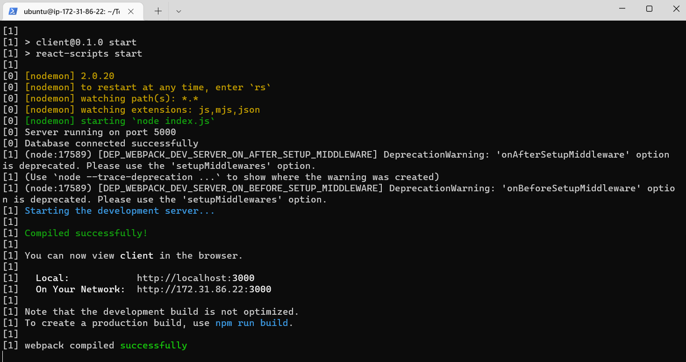
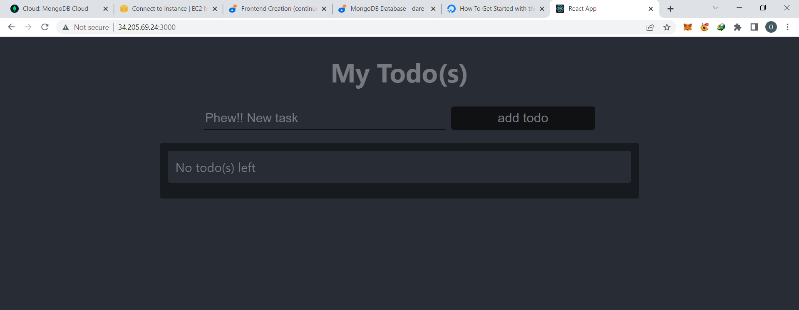

# Mern stack implementation

## Step 1

`sudo apt update`

`sudo apt upgrade`

`curl -fsSL https://deb.nodesource.com/setup_18.x | sudo -E bash -`

`sudo apt-get install -y nodejs`

`node -v`

`npm -v`

`mkdir Todo`

`ls`

`npm init`

## Step 2

`npm install express`

`touch index.js`

`npm install dotenv`

`vim index.js`

`node index.js`

`http://<PublicIP-or-PublicDNS>:5000`

`mkdir routes`

`touch api.js`

`vim api.js`

## Models

`npm install mongoose`

`mkdir models`

`cd models`

`touch todo.js`

`vim todo.js`

`vim api.js`

## Mongodb database

`touch .env`

`vi .env`

`DB = 'mongodb+srv://<username>:<password>@<network-address>/<dbname>?retryWrites=true&w=majority'`

`vim index.js`

`node index.js`

`http://<PublicIP-or-PublicDNS>:5000/api/todos`

#### Optional Delete request

## Frontend creation

` npx create-react-app client`

`npm install concurrently --save-dev`

`npm install nodemon --save-dev`

`cd client`

`vi package.json`

`npm run dev`

`cd client`

`cd src`

`mkdir components`

`cd components`

`touch Input.js ListTodo.js Todo.js`

`vi Input.js`

`cd ..`

`cd ..`

`npm install axios`

## Frontend creation (contd)

`cd src/components`

`vi ListTodo.js`

`cd ..`

`vi App.js`

`vi App.css`

`vim index.css`

`cd ../..`

`npm run dev`

